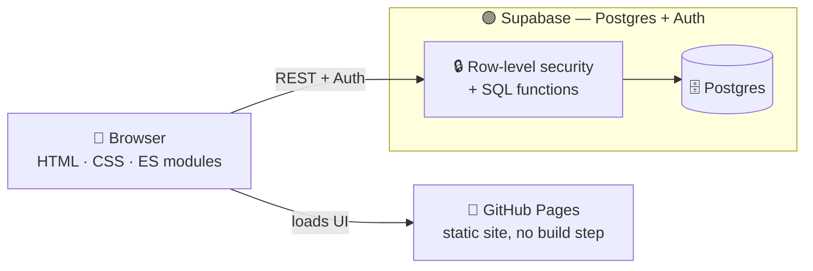
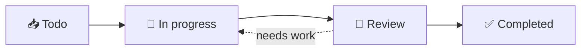

<div align="center">

# 📋 Project Manager

**A team project-management web app** — projects with member roles, a drag-and-drop Kanban board,
checklists, tags, comments, deadlines, notifications and a full activity history.

[](https://apurvdas.github.io/ci4-project-manager/)

[](https://apurvdas.github.io/ci4-project-manager/)
[](https://supabase.com)
[](#)
[](#)
[](project-manager)

</div>

---

## 🚀 Try it now

**Live:** <https://apurvdas.github.io/ci4-project-manager/> — sign in with the shared guest account:

| 🔑 Field | Value |
|---|---|
| **Email** | `guest@example.com` |
| **Password** | `TourTheBoard-2026` |

The guest belongs to a small team working on four projects — a coffee shop's online ordering, a
fitness-app rebuild, a brand refresh, and a finished support portal.

<details>
<summary><b>👉 Things to try once you're in</b> (click to expand)</summary>

<br>

| Where | Try this |
|---|---|
| **Dashboard** | See your open tasks, deadlines and project progress at a glance. |
| **Board** | Drag a card across *Todo → In progress → Review → Completed*. |
| **A task** | Tick checklist items (progress updates live), paste a list straight into the checklist, or leave a comment. |
| **Overdue work** | Flagged in red — *"Order status notifications"* is already past its deadline. |
| **☾ / ☀ switch** | Flip dark / light mode from the top bar. The whole app works on phones, too. |

> This account is **shared**, so please keep it friendly — the sample data is reset from time to time.
> Guests can't delete projects or manage members; those need a manager or owner role.
> You can also **register your own account** and run projects of your own.

</details>

---

## ✨ Features

| | Feature | What it does |
|:--:|---|---|
| 🗂️ | **Projects & roles** | Four-rung role ladder (owner → manager → member → viewer), enforced in the database. |
| ✅ | **Tasks** | Multiple assignees, priorities, due dates, comments, tags and checklists. |
| 🧲 | **Kanban board** | Drag-and-drop between columns; every move is re-validated server-side. |
| ☑️ | **Checklists** | Live progress, paste-a-list bulk add. |
| 🏷️ | **Tags** | Shared, colour-coded labels across a project's tasks. |
| 💬 | **Comments** | Discussion per task; authors and managers can tidy up. |
| ⏰ | **Deadlines** | Overdue work flagged in red on the dashboard and board. |
| 🔔 | **Notifications** | Assignments, status changes, comments, invites — you're never notified of your own action. |
| 📜 | **Activity history** | Every change recorded as a filterable, paginated project log. |
| 🌗 | **Dark / light + mobile** | Theme switch and a layout that works on phones. |

---

## 🔐 Roles at a glance

Permissions aren't just hidden buttons — they're enforced in the backend (Postgres row-level
security in the live version, `App\Libraries\ProjectPolicy` in the original CI4 build).

| Capability | 👁️ Viewer | 🧑‍💻 Member | 🛠️ Manager | 👑 Owner |
|---|:--:|:--:|:--:|:--:|
| View the project | ✅ | ✅ | ✅ | ✅ |
| Create / update tasks, comment, tick checklists | — | ✅ | ✅ | ✅ |
| Create tags | — | ✅ | ✅ | ✅ |
| Delete **own** task / comment | — | ✅ | ✅ | ✅ |
| Project settings | — | — | ✅ | ✅ |
| Add / remove members & viewers | — | — | ✅ | ✅ |
| Delete **any** task / comment / tag | — | — | ✅ | ✅ |
| Archive or delete the project | — | — | — | ✅ |
| Change any member's role | — | — | — | ✅ |

<details>
<summary>The fiddly bits the ladder doesn't show</summary>

<br>

- A manager can bring in **members and viewers**, but can't mint another manager or a second owner.
- Managers **can't remove one another** — only the owner can.
- The **owner can never be removed or duplicated**; ownership is transferred, not cloned.
- Non-members get a **404, not a "403"** — the response never reveals which projects exist.

</details>

---

## 🧱 How it's built



> The browser is never trusted — every permission rule lives in the database.

The **live version** (`project-manager/v2`) is hosted free: a static front end on GitHub Pages and
Supabase for the database and auth. Every permission from the original `ProjectPolicy` is enforced
in Postgres with row-level security and SQL functions — the UI only *hides* controls.

The **original version** (`project-manager`) is the same app on a classic PHP stack.

### Tech stack

| Layer | Live version (v2) | Original version |
|---|---|---|
| **Front end** | Plain HTML / CSS / ES modules, no build step | CodeIgniter 4 views, vanilla JS |
| **Back end** | Supabase (Postgres + Auth), RLS + SQL functions | PHP 8.3, CodeIgniter 4.7 |
| **Auth** | Supabase Auth | CodeIgniter Shield 1.4 |
| **Database** | Postgres | MySQL 8 |
| **Hosting** | GitHub Pages + Supabase (free tier) | Self-hosted PHP + MySQL |
| **Tests** | API permission tests + Playwright | 244 PHPUnit tests + Playwright |

---

## 🗺️ The Kanban flow



---

## 📂 Repository layout

| Path | What's there |
|---|---|
| [`project-manager/v2`](project-manager/v2) | **Live version** — static front end (`web/`) + Supabase (`supabase/`). Its README covers running, testing and deploying. |
| [`project-manager`](project-manager) | **Original** PHP / CodeIgniter 4 build. |

---

## 🛠️ Run it locally

<details>
<summary><b>Live version (Supabase + static site)</b></summary>

<br>

Needs **Docker Desktop** running and **Node**.

```bash
cd project-manager/v2
npm install
npx supabase start      # local Postgres + Auth + API; applies migrations and seed.sql
npm run serve           # http://localhost:8123
```

Sign in as `admin@example.test` (or `manager`, `developer`, `designer`, `tester`), password
`Password123!`. Local emails (login links, password resets) land in **Mailpit** at
<http://127.0.0.1:54324>; **Supabase Studio** is at <http://127.0.0.1:54323>.
`npx supabase db reset` rebuilds the database from scratch.

```bash
npm test     # permission rules, called through the API as each seeded role
npm run e2e  # Playwright browser tests
```

Full deploy steps are in the [v2 README](project-manager/v2).

</details>

<details>
<summary><b>Original version (PHP / CodeIgniter 4)</b></summary>

<br>

Needs **PHP 8.3**, **MySQL 8** and **Composer** (Node only for the e2e tests).

```bash
cd project-manager
composer install
cp env .env            # then set the database section
php spark migrate
php spark db:seed DevelopmentSeeder
npm run serve          # http://localhost:8123
```

Seeded accounts all use `Password123!`; sign in with the **email** (`admin@example.test`, plus
`manager`, `developer`, `designer`, `tester`).

```bash
vendor/bin/phpunit tests   # 244 unit and feature tests
npm run e2e                # Playwright browser tests
```

</details>

---

## 📄 Licence

No licence has been chosen yet. CodeIgniter, Shield and the other dependencies keep their own
licences; add a `LICENSE` file to set the terms for the application code.

---

<div align="center">

**🔗 Open the app:** <https://apurvdas.github.io/ci4-project-manager/>
· Local dev: <http://localhost:8123>
· Mailpit: <http://127.0.0.1:54324>
· Supabase Studio: <http://127.0.0.1:54323>

</div>
