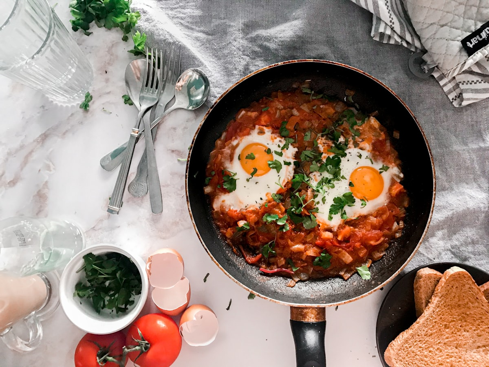
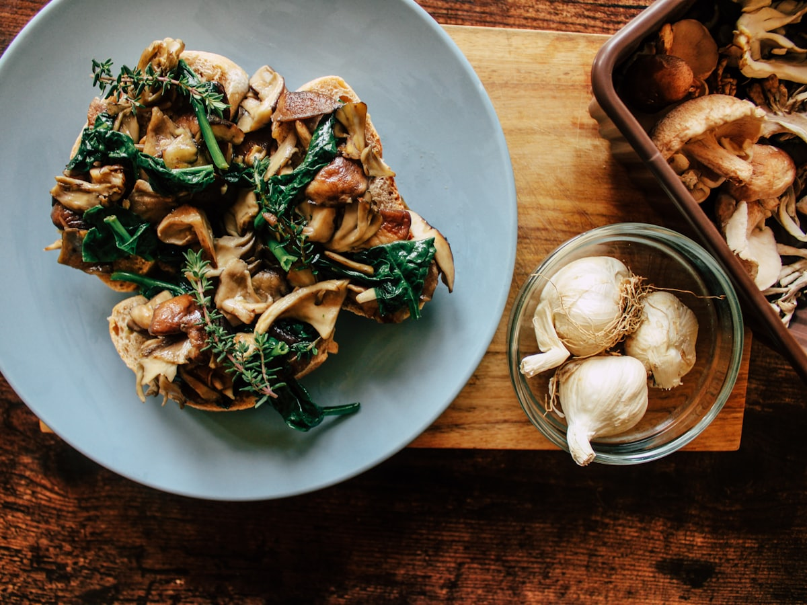
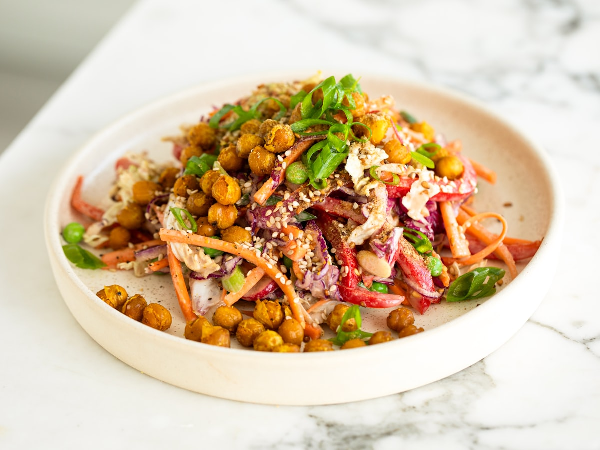
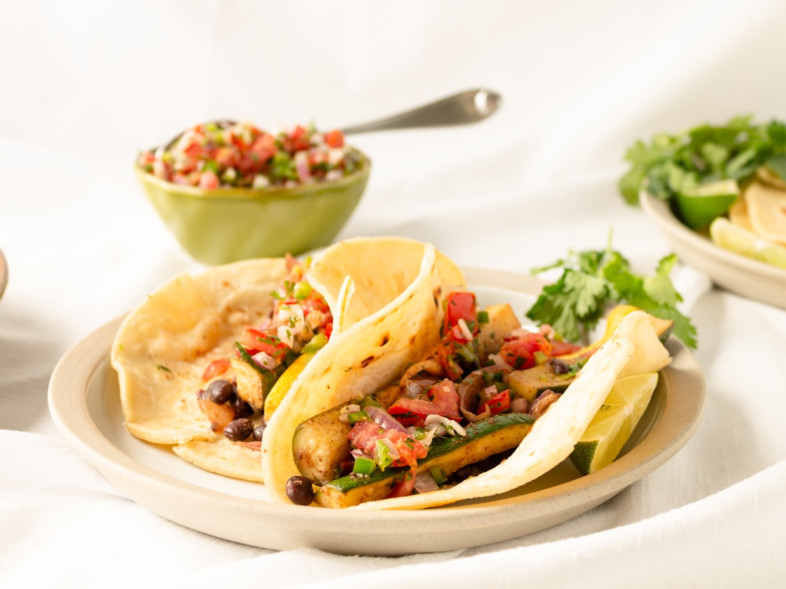
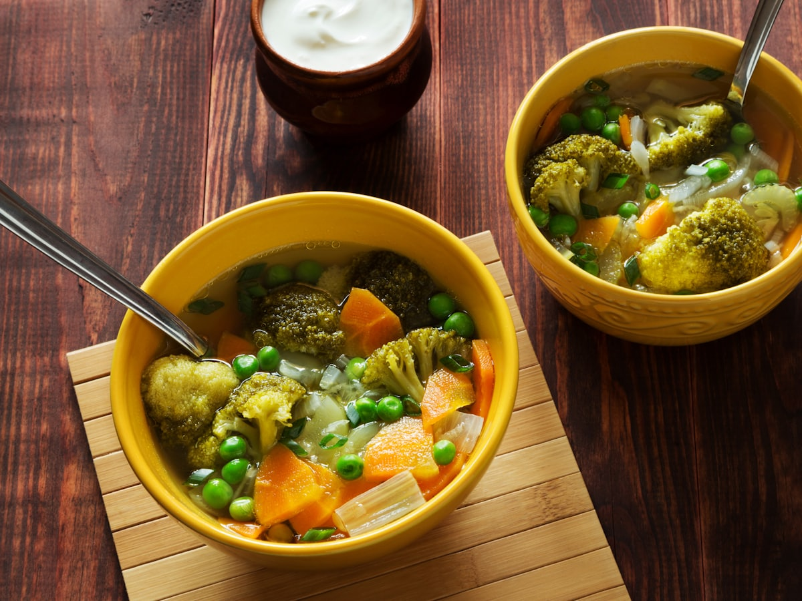
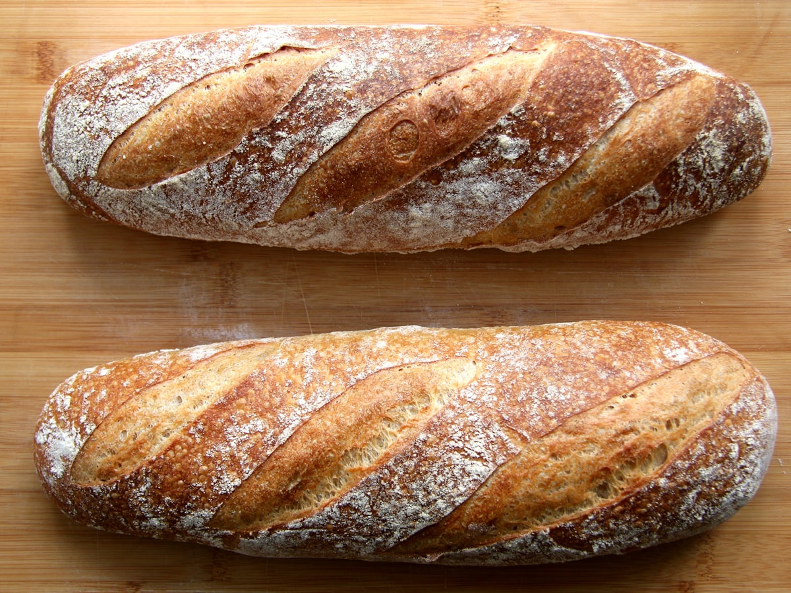
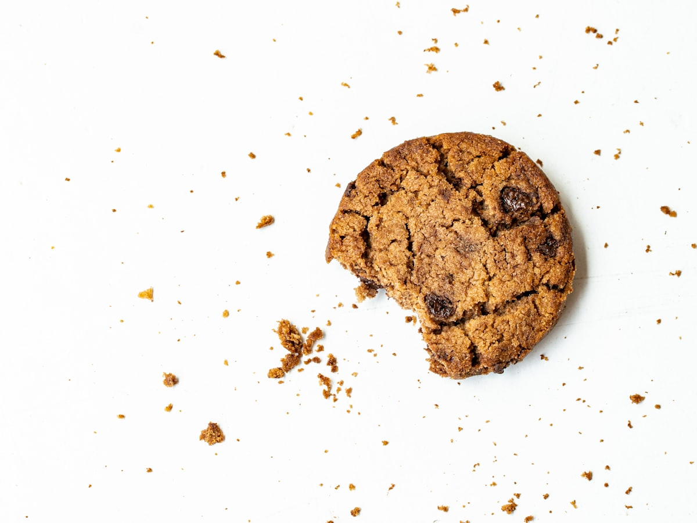

# Ciba Library

A motion-first community food-recipe website. [anime.js](https://animejs.com) is
the centerpiece here, motion is a signature feature, not decoration, layered over
a calm, minimal, achromatic-plus-terracotta visual style with full light **and**
dark mode.



<p align="center">
  
  
  
</p>
<p align="center">
  
  
  
</p>

## What it does

- **Browse** a library of recipes with category and tag filtering (tags grouped by
  Diet, Meal Type, and Cuisine), plus sort by newest, top-rated, or most-discussed.
- **Accounts** with email + password and Google sign-in, protected dashboard,
  follow other cooks, and an activity feed.
- **Submit and edit** recipes with ingredients, steps, and images.
- **Rate and comment** on recipes.
- **Scale servings** live, the ingredient quantities tween to the new count.
- **Shopping list** persisted per user, add a recipe's ingredients and check them off.

## The motion

anime.js drives four signature animations, each motivated by feedback, hierarchy,
or reveal, and every one collapses gracefully under `prefers-reduced-motion`:

1. **Servings scaler** number tweening as you change the serving count.
2. **Filter/grid FLIP** re-layout when you filter or sort the browse grid.
3. **Add-to-shopping-list** flight, the item arcs to the cart badge.
4. **Animated hero** split-text headline and scroll reveals.

A single WebGL piece (a react-three-fiber bowl of ramen) anchors the home hero;
everything else is anime.js-driven CSS 3D that flattens under reduced motion.

## Stack

- **Next.js 16** (App Router, TypeScript, Turbopack), **React 19**, **Tailwind CSS v4**
- **anime.js v4** for motion, **three.js** / react-three-fiber for the one 3D hero
- **Prisma** + **PostgreSQL** (local dev DB via Docker)
- **Auth.js / NextAuth v5** (Credentials + Google, JWT sessions, bcrypt)
- **Vitest** unit tests and **Playwright** e2e smoke tests

## Getting started

Requirements: Node, Docker Desktop.

```bash
# 1. Install
npm install

# 2. Configure environment
cp .env.example .env      # then fill in AUTH_SECRET (npx auth secret) and, optionally, Google OAuth

# 3. Start the database, run migrations, seed demo content
docker compose up -d
npx prisma migrate dev
npm run db:seed

# 4. Run the app
npm run dev
```

Open [http://localhost:3000](http://localhost:3000).

Seeded demo login: `mara@ciba.test` / `cibademo123`.

## Tests

```bash
npm test                  # Vitest unit tests (scaling + search logic)
npx playwright test       # e2e smoke: browse, filter, detail, scale, sign in (DB must be up)
npx tsc --noEmit          # types
npx eslint .              # lint
```

## Project structure

- `src/app` — routes (home, browse, recipe detail, submission, dashboard, auth, styleguide)
- `src/components` — recipe, motion, auth, dashboard, and UI primitives
- `src/lib` — motion tokens, scaling, search, validation, server actions
- `src/data` — server-only data-access layer (Prisma-backed)
- `prisma` — schema, migrations, seed
- `public/images/recipes` — curated recipe photography

Visit `/styleguide` for a living catalogue of the motion system, easing tokens,
press states, and editorial type scale.
